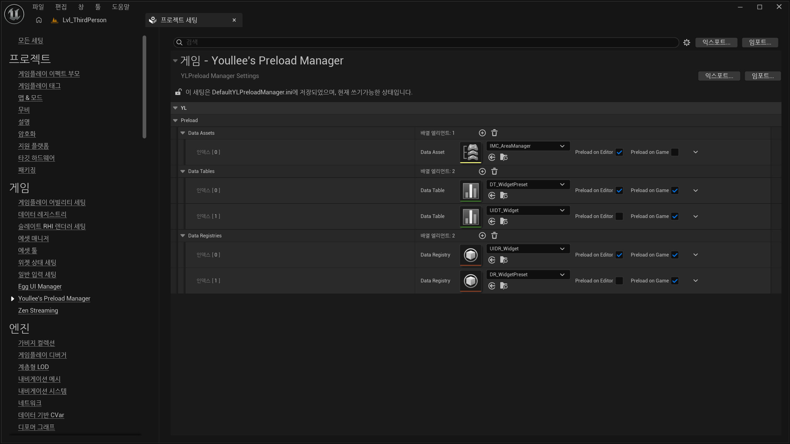

# Youllee's Preload Manager

Unreal Engine에서 자주 사용하는 데이터 에셋을 Editor World와 Game World에 미리 로드해두기 위한 플러그인입니다.

프로젝트 설정에서 `DataAsset`, `DataTable`, `DataRegistry`를 등록하면, 지정한 월드 수명주기에 맞춰 에셋을 동기 로드하고 강한 참조로 유지합니다. 게임 시스템이 데이터를 요청하기 전에 필요한 에셋을 미리 준비해두고 싶을 때 사용할 수 있습니다.



## 주요 기능

- `DataAsset` 프리로드
- `DataTable` 프리로드
- `DataRegistry` 프리로드
- 에셋별 `EditorWorld` / `GameWorld` 프리로드 여부 설정
- 에디터 월드가 유지되는 동안 Editor 프리로드 에셋 유지
- 게임 월드가 존재하는 동안 Game 프리로드 에셋 유지
- PIE 실행 시 Game World 기준으로 프리로드
- 에디터에서 감시 중인 에셋이 저장되면 Editor 프리로드 갱신
- 프리로드 데이터 배열을 한 줄 형태로 보여주는 디테일 패널 커스터마이징

## 지원 엔진 버전

- Unreal Engine 5.7

`.uplugin` 파일은 UE 5.7을 대상으로 작성되어 있습니다. 인접한 버전에서도 동작할 수 있지만, 현재 기준으로는 UE 5.7을 대상으로 관리합니다.

## 설치

`YLPreloadManager` 폴더를 프로젝트의 `Plugins` 폴더 아래에 복사합니다.

```text
YourProject/
  Plugins/
    YLPreloadManager/
      YLPreloadManager.uplugin
      Source/
      Config/
      Resources/
```

그 후 Unreal Editor를 다시 실행하고, 필요하면 플러그인을 활성화한 뒤 프로젝트를 다시 빌드합니다.

## 설정 위치

프로젝트 설정에서 아래 경로로 이동합니다.

```text
Project Settings > Game > Youllee's Preload Manager
```

설정 화면에는 세 종류의 프리로드 목록이 있습니다.

- **Data Assets**: `UDataAsset` 기반 에셋을 등록합니다.
- **Data Tables**: `UDataTable` 에셋을 등록합니다.
- **Data Registries**: `UDataRegistry` 에셋을 등록합니다.

각 항목에는 다음 옵션이 있습니다.

- **Preload on Editor**: 에디터 월드에서 프리로드합니다.
- **Preload on Game**: 게임 월드에서 프리로드합니다.

PIE는 게임 월드를 생성하므로, **Preload on Game**이 켜진 에셋은 PIE 시작 시에도 프리로드됩니다.

## 에셋 수명주기

이 플러그인은 로드한 에셋을 `TStrongObjectPtr`로 보관합니다. 따라서 프리로드 목록에 들어간 에셋은 해당 수명주기가 끝날 때까지 GC 대상이 되지 않습니다.

- Editor 프리로드 에셋은 Editor World용 배열에 보관됩니다.
- Game 프리로드 에셋은 Game World용 배열에 보관됩니다.
- Game World가 정리될 때 Game 프리로드 배열은 비워집니다.
- 플러그인이 종료될 때 Editor / Game 프리로드 배열이 모두 비워집니다.

Editor 프리로드와 Game 프리로드는 서로 분리되어 있습니다. Editor World에서 프리로드된 에셋이 PIE의 Game World 프리로드 참조로 그대로 공유되지는 않습니다.

## 에디터 갱신

에디터 빌드에서는 Editor World에 프리로드된 에셋을 약한 참조로 감시합니다.

감시 중인 에셋이 저장되면 다음 순서로 Editor 프리로드를 갱신합니다.

1. 기존 Editor 프리로드 목록을 비웁니다.
2. 현재 프로젝트 설정을 다시 읽습니다.
3. `Preload on Editor`가 켜진 에셋을 다시 동기 로드합니다.

이 갱신은 에디터에서만 동작합니다. 런타임 게임 빌드에서는 에셋 저장 감시를 하지 않습니다.

## Config

설정값은 아래 파일에 저장됩니다.

```text
Config/DefaultYLPreloadManager.ini
```

플러그인에는 `Config/FilterPlugin.ini`가 포함되어 있습니다. 이 파일은 플러그인을 패키징할 때 `Config` 폴더가 함께 포함되도록 하기 위한 용도입니다.

## Data Registry 참고

`DataRegistry`를 사용하려면 Unreal Engine의 `DataRegistry` 플러그인이 필요합니다.

이 플러그인은 등록된 Data Registry를 `UDataRegistrySubsystem::LoadRegistryPath`로 로드합니다. 로드된 Registry가 이미 초기화된 상태라면 `ResetRuntimeState()`를 호출해 런타임 상태를 다시 구성할 수 있도록 합니다.

## 주의사항

- 프리로드는 동기 로드로 처리됩니다.
- 매우 큰 에셋을 많이 등록하면 에디터 시작 또는 게임 월드 시작 시점의 비용이 커질 수 있습니다.
- 이 플러그인은 에셋을 미리 로드하고 참조를 유지하는 용도이며, 모든 데이터 초기화 순서를 자동으로 보장하는 시스템은 아닙니다.
- Game World 기준 프리로드는 실제 게임 실행뿐 아니라 PIE에서도 동작합니다.

## 라이선스

MIT License. 자세한 내용은 [LICENSE](LICENSE)를 참고하세요.
